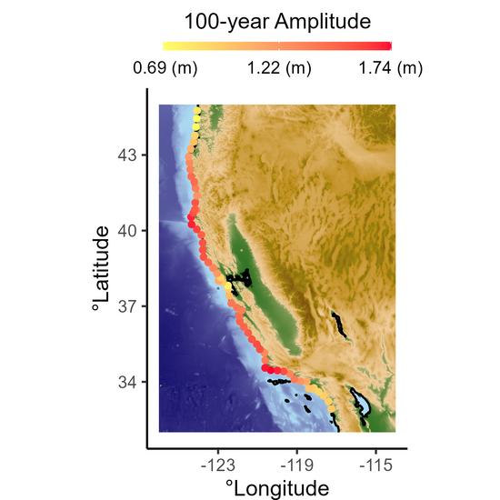

***"Bayesian hierarchical modeling for probabilistic estimation of tsunami amplitude from far-field earthquake sources"*** by Georgios Boumis, Eric L. Geist, and Danhyang Lee (2023).

  

## Summary
Devastating tsunamis are rare, but their consequences can be destructive for people who live close to the coast and their livelihoods. Assessing tsunami hazard, e.g., nearshore tsunami height, typically requires us to resort to physics-based models since historical data from individual monitoring stations are scarce. In this work, we develop a spatial Bayesian hierarchical model for tsunami data from far-field earthquake sources along the shorelines of California and Oregon. The model can artificially augment the data catalog of each tide gauge by capturing spatial dependence between stations, and thus allows for a more robust tsunami hazard analysis than analyzing station data in isolation.

## Details
The Stan code for the Bayesian hierarchical model along with an R script to run the model are included in the ***"code"*** folder. Different data used for this analysis are provided inside the ***"data"*** folder. Additional scripts for other analyses described in the article are available upon request.
